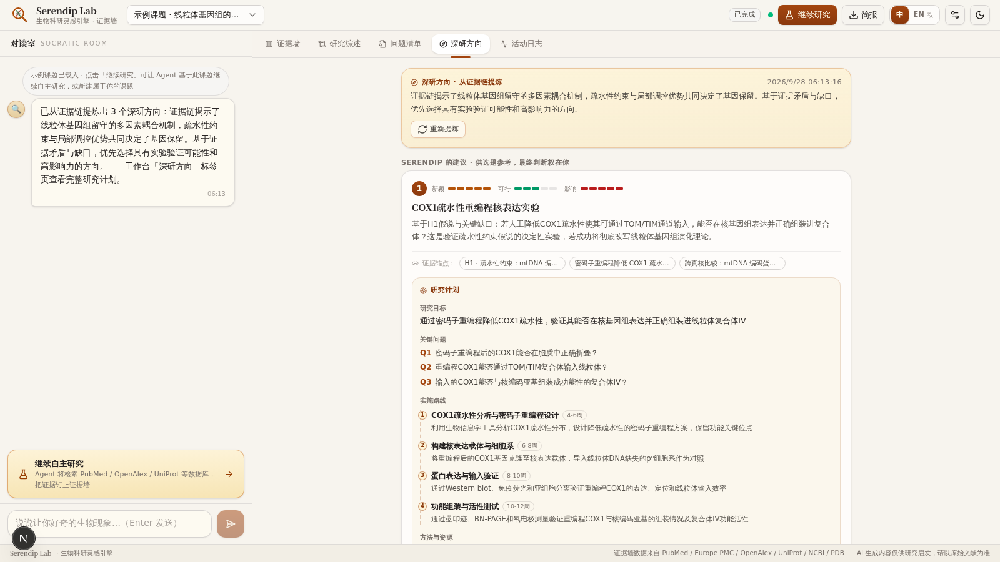
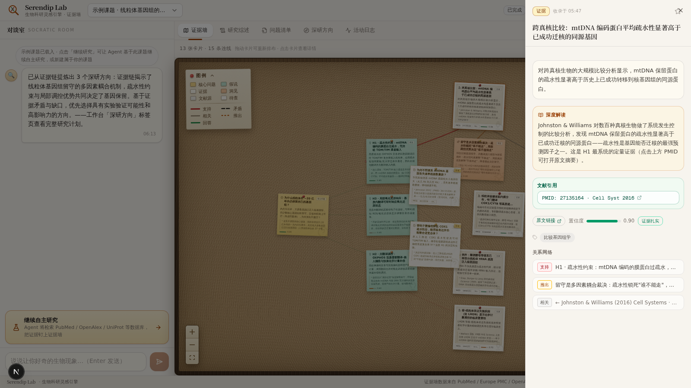
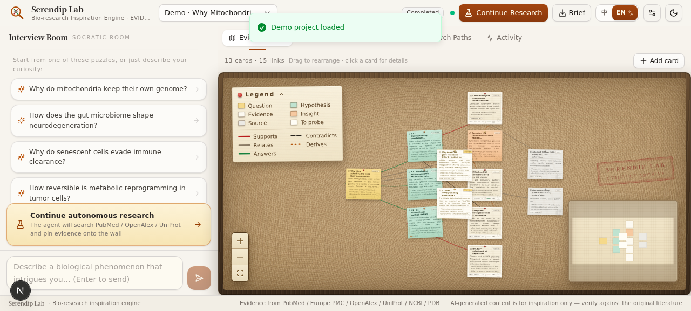

<div align="center">

# 🔍 Serendip Lab · 生物科研灵感引擎

**Bio-research Inspiration Engine · 与 AI 科研合作助手对谈，把模糊的好奇心磨成值得研究的科学问题。**

Agent 通过苏格拉底式提问发掘你的科研兴趣，随后**长时间自主工作**——检索 PubMed / Europe PMC / OpenAlex / UniProt / NCBI / PDB 等生物学数据库，把证据一张张钉上**证据墙**（软木板 + 图钉 + 红绳），最终梳理成有逻辑的研究综述，并告诉你**哪些问题值得被进一步研究**。支持**中英双语界面**，Agent 产出语言随界面语言切换。

`苏格拉底访谈` · `自主 ReAct 研究` · `多数据库工具调用` · `人机协同 steering` · `证据墙可视化` · `研究综述叙事` · `中英双语`


</div>

---

## ✨ 产品能力

| 能力 | 说明 |
|---|---|
| 💬 **苏格拉底访谈** | AI 访谈者一次一个问题、层层递进地追问，引用你的原话挖掘矛盾与张力，把模糊直觉打磨成具体可研究的科学问题 |
| 🔎 **自主研究** | 启动后 Agent 长时间自主工作（预算可控：24/40/80 步），一步一步建立扎实的证据链 |
| 🧰 **11 种研究工具** | PubMed esearch/esummary/efetch、Europe PMC、OpenAlex（引用热度）、UniProt、NCBI Gene、RCSB PDB、Taxonomy、ClinVar、Web 搜索、网页精读 |
| 🤝 **人机协同** | 研究期间你随时补充素材（steering），Agent 在检查点纳入；遇到只有你知道的关键信息会主动 `ask_user` 挂起等待 |
| 🧵 **证据墙** | 问题（琥珀便签）→ 假说（青瓷便签）→ 证据（米白拍立得）→ 洞见（橙便签）→ 文献源（报纸灰卡）→ 待查空白（虚线卡），用红绳（支持/矛盾/相关/推出/回答）串成关系网；卡面直接展示**深度解读节选 / 标签 / 置信度条 / 来源 chip**，点开看全文与**可点击的文献引用**（PMID/DOI/UniProt/PDB 自动解析为原文链接） |
| 🌐 **中英双语** | 顶栏一键切换 中 / EN：全部界面文案、示例课题、Agent 产出（访谈追问、研究综述、问题清单、深研方向）随语言切换；偏好本地持久化 |
| 📜 **研究综述** | 碎片证据被梳理成「现象与矛盾 → 证据链 → 推演 → 未解之谜 → 下一步建议」的叙事弧 |
| ⭐ **问题清单** | 综合分析师按新颖性/可行性/影响力为候选科学问题打分，标记最值得深挖的一个 |
| 🧭 **深研方向** | 研究完成后一键让首席战略顾问审阅整面证据墙：从矛盾、例外与缺口中提炼 3-4 个值得深入研究的方向，每个附完整研究计划（研究目标 / 关键问题 / 分阶段路线含时长 / 方法资源 / 预期产出 / 风险对策）与可点击的深读文献；证据锚点可跳回证据墙卡片 |
| 📤 **研究简报** | 一键导出 Markdown 简报（综述 + 问题清单 + 证据墙清单，随界面语言） |
| ⚙️ **LLM 配置** | 顶栏设置面板切换 15 家供应商（内置网关 / DeepSeek / 智谱 GLM / MiniMax / 通义千问 / Kimi / 火山方舟 / SiliconFlow / OpenAI / Claude / OpenRouter / Groq / xAI / Ollama / 自定义端点）· **填 Key 后自动拉取远端模型列表**（GET /models，也可手动获取）· 温度 · 分面孔长链推理开关 · 连接测试，PUT 后热生效 |

## 🖼️ 界面一览

| 欢迎与访谈 | 暗色模式 |
|---|---|
|  |  |

| 深研方向（从证据链提炼 + 研究计划） | 卡片详情（深度解读 + 可点击引用） |
|---|---|
|  |  |

| 中文界面 | English UI（一键切换） |
|---|---|
|  |  |

左侧**对谈室**负责发散（访谈 + 研究直播 + steering），右侧**工作区**负责沉淀：证据墙 / 研究综述 / 问题清单 / 深研方向 / 活动日志五个标签页。桌面端双栏、移动端底部导航，支持明暗主题与中英双语。

## 🧠 Agent 层设计（借鉴开源 Agent 的优点）

这是本项目的灵魂，架构详见 [`docs/ARCHITECTURE.md`](docs/ARCHITECTURE.md)：

| 借鉴对象 | 吸收的能力 |
|---|---|
| **ReAct** | thought → action → observation 交错推理；文本 JSON 协议（不依赖原生 function calling，跨模型更稳） |
| **OpenHands / OpenDevin** | 一切皆事件（Event Stream）：每个动作经 SSE 直通前端；用户随时 steering |
| **LangGraph** | 显式阶段状态机（interview → planning → investigating → synthesizing → done）+ 每步 checkpoint 持久化到 SQLite |
| **AutoGPT / AgentGPT** | 预算约束（步数 + 墙钟时间）下的长时自主循环；每完成 2 个任务强制综合检查点 |
| **Reflexion** | 双层自愈：JSON 解析失败→错误回灌重试；仍失败→纠错观察注入 scratchpad 改变下一步提示词；连续失败熔断暂停 |
| **CAMEL / Socratic** | 访谈者人格与提问品味（一次一问、引用原话、挖掘矛盾） |
| **DeepSeek Harness / pdb-tracker 供应商目录** | LLM 配置层：内置网关 + OpenAI 兼容适配器双通道，供应商目录驱动（baseURL/认证头/模型），thinking 按 agent 面孔独立开关 |

**四张面孔**：访谈者（Interviewer）/ 规划师（Planner）/ 调研员（Investigator）/ 综合分析师（Synthesizer）各司其职；综合分析师还负责维护证据墙图结构（补问题/假说节点、拉红绳、调置信度）。此外还有第五位顾问——**首席研究战略顾问**（Directions）：研究告一段落后把整面证据墙压缩成简报，从中提炼值得深挖的研究方向并制定可执行研究计划（thinking 增强推理）。**所有面孔的产出语言由会话 lang（zh/en）驱动**，前端随请求透传、后端注入语言指令。

**长时自主的保障**：步数/时间双预算 · 每步落库可恢复 · LLM 429 限流长退避（5s/15s，综合师额外 20s/40s 重试）· 工具 25s 超时 + NCBI eutils 全局 380ms 限速队列 · scratchpad 滚动压缩（最近 14 条完整观察，更早压成单行摘要）· 服务重启后 running 会话标记 interrupted 可一键续查。

## 🏗️ 技术架构

```
浏览器 ── Next.js 16 前端（/ 单页工作台）
   │  fetch('/api/agent/*?XTransformPort=3002') + EventSource(SSE)
   ▼ Caddy 网关（XTransformPort 端口转发）
agent-service（Bun mini-service, 端口 3002）
   ├─ Bun.serve 路由 + SSE 广播
   ├─ AgentRuntime 状态机（四张面孔）
   ├─ 工具层：11 个生物学数据库工具 + 6 个图操作工具
   ├─ z-ai-web-dev-sdk（LLM / web_search / page_reader，仅后端）
   └─ bun:sqlite（WAL）持久化
          │
          ▼ 外部 API（全部免费无 Key）
NCBI E-utilities · Europe PMC · OpenAlex · UniProt · RCSB PDB
```

- **前端**：Next.js 16 App Router · React 19 · Tailwind CSS 4 · shadcn/ui · React Flow v12（自定义软木板节点 + 四层红绳渲染）· dagre 语义分列布局 · framer-motion · zustand
- **后端**：独立 Bun 服务 · TypeScript 全栈 · 文本 ReAct 协议 · SQLite 检查点
- **LLM 通道**：内置 z-ai 网关（GLM-4-Plus，支持 R1 式 thinking）为默认；顶栏「LLM 配置」可切换到 15 家 OpenAI 兼容供应商（DeepSeek / 智谱 GLM / MiniMax / Qwen / Kimi / 火山方舟 / SiliconFlow / OpenAI / Claude / OpenRouter / Groq / xAI / Ollama / 自定义端点），**填写 API Key 后自动拉取该供应商的模型列表**（OpenAI 兼容 GET /models，Anthropic 走 x-api-key，过滤 embedding/TTS 等非对话模型）；API Key 仅存本机 SQLite，支持环境变量兜底与连接测试

## 🚀 运行

```bash
# 1. 前端（端口 3000）
bun install
bun run dev

# 2. Agent 后端（端口 3002）
cd mini-services/agent-service
bun install
bun run dev

# 3. 打开 http://localhost:3000（网关 :81 转发 API）
```

> Agent 后端依赖 `z-ai-web-dev-sdk` 提供 LLM 与 Web 检索能力，需要相应运行环境。

## 📁 目录导览

```
src/
  app/                    # Next.js 单页入口
  components/studio/      # 工作台：对谈室/证据墙/综述/问题清单/深研方向/活动日志/检视器
  components/canvas/      # 证据墙（React Flow 自定义节点 + 红绳边 + 布局）
  lib/                    # 共享类型 + API 客户端 + 引用解析器 + i18n 双语字典
  store/                  # zustand 全局状态
  hooks/                  # SSE 订阅钩子
mini-services/agent-service/
  index.ts                # Bun.serve 路由入口
  src/runtime.ts          # AgentRuntime 状态机（ReAct 循环 + 预算 + 自愈）
  src/directions.ts       # 深研方向生成器（战略顾问简报 + 归一化）
  src/tools.ts            # 11 个生物学数据库工具 + 限速队列
  src/prompts.ts          # 四张面孔提示词 + 战略顾问提示词
  src/llm-config.ts       # 15 家供应商目录 + 配置持久化
  src/llm.ts              # 双通道 LLM（z-ai SDK / OpenAI 兼容）+ 模型发现
  src/db.ts               # SQLite CRUD
  src/emitter.ts          # SSE 广播
  src/lang.ts             # 会话语言（lang 指令注入 + 双语 notice 文案）
  src/seed.ts             # 示例课题（线粒体基因组留守之谜，中/英双语内容包）
docs/ARCHITECTURE.md      # 前后端契约（唯一真源）
```

## ⚠️ 说明

- AI 生成内容仅供研究启发，关键论断请以原始文献为准（界面页脚常驻提示）。
- 示例课题中的文献线索为教学演示用途。

---

<div align="center">

**Serendip Lab** —— *灵感不期而遇，证据水落石出。* 🔍🧬

</div>
