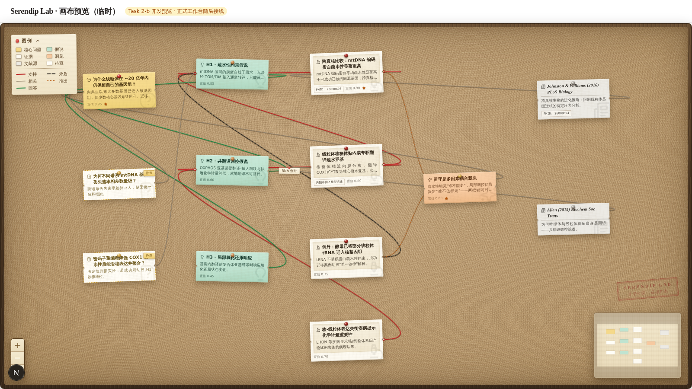
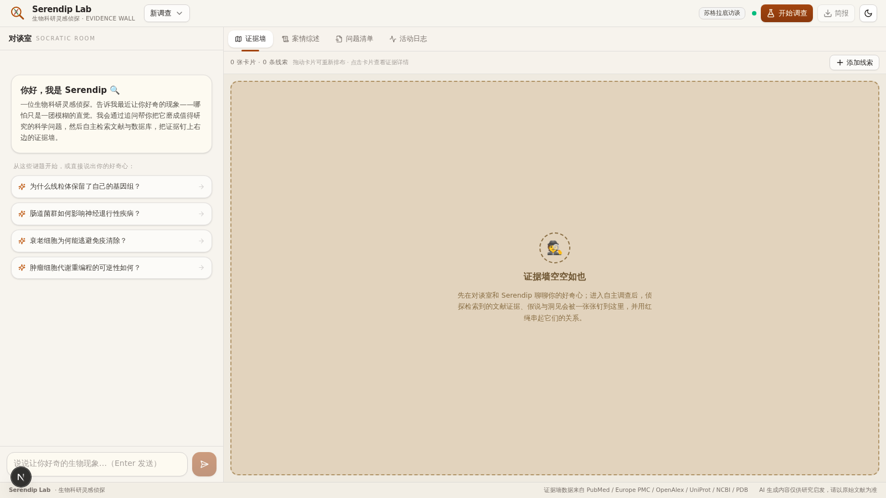
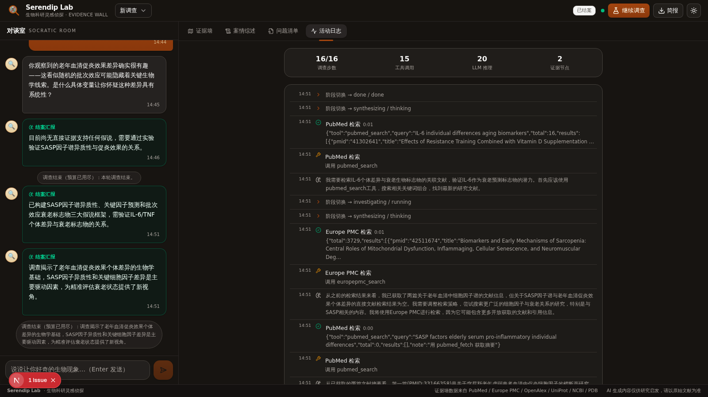

<div align="center">

# 🔍 Serendip Lab · 生物科研灵感侦探

**与 AI 侦探对谈，把模糊的好奇心磨成值得研究的科学问题。**

Agent 通过苏格拉底式提问发掘你的科研兴趣，随后**长时间自主工作**——检索 PubMed / Europe PMC / OpenAlex / UniProt / NCBI / PDB 等生物学数据库，把证据一张张钉上**侦探式证据墙**（软木板 + 图钉 + 红绳），最终梳理成有逻辑的结案陈词，并告诉你**哪些问题值得被进一步研究**。

`苏格拉底访谈` · `自主 ReAct 调查` · `多数据库工具调用` · `人机协同 steering` · `证据墙可视化` · `结案陈词叙事`



</div>

---

## ✨ 产品能力

| 能力 | 说明 |
|---|---|
| 🕵️ **苏格拉底访谈** | AI 侦探一次一个问题、层层递进地追问，引用你的原话挖掘矛盾与张力，把模糊直觉打磨成具体可研究的科学问题 |
| 🔎 **自主调查** | 进入调查后 Agent 长时间自主工作（预算可控：24/40/80 步），像侦探一样建立证据链 |
| 🧰 **11 种调查工具** | PubMed esearch/esummary/efetch、Europe PMC、OpenAlex（引用热度）、UniProt、NCBI Gene、RCSB PDB、Taxonomy、ClinVar、Web 搜索、网页精读 |
| 🤝 **人机协同** | 调查期间你随时补充线索（steering），Agent 在检查点纳入；遇到只有你知道的关键信息会主动 `ask_user` 挂起等待 |
| 🧵 **侦探证据墙** | 问题（琥珀便签）→ 假说（青瓷便签）→ 证据（米白拍立得）→ 洞见（橙便签）→ 文献源（报纸灰卡）→ 待查空白（虚线卡），用红绳（支持/矛盾/相关/推出/回答）串成关系网 |
| 📜 **结案陈词** | 碎片证据被梳理成「迷雾 → 证据链 → 推演 → 未解之谜 → 下一步建议」的叙事弧 |
| ⭐ **问题清单** | 综合师按新颖性/可行性/影响力为候选科学问题打分，标记最值得深挖的一个 |
| 📤 **调查简报** | 一键导出 Markdown 简报（叙事 + 问题清单 + 证据档案） |

## 🖼️ 界面一览

| 欢迎与访谈 | 暗色模式 |
|---|---|
|  |  |

左侧**对谈室**负责发散（访谈 + 调查直播 + steering），右侧**工作区**负责沉淀：证据墙 / 案情综述 / 问题清单 / 活动日志四个标签页。桌面端双栏、移动端底部导航，支持明暗主题。

## 🧠 Agent 层设计（借鉴开源 Agent 的优点）

这是本项目的灵魂，架构详见 [`docs/ARCHITECTURE.md`](docs/ARCHITECTURE.md)：

| 借鉴对象 | 吸收的能力 |
|---|---|
| **ReAct** | thought → action → observation 交错推理；文本 JSON 协议（不依赖原生 function calling，跨模型更稳） |
| **OpenHands / OpenDevin** | 一切皆事件（Event Stream）：每个动作经 SSE 直通前端；用户随时 steering |
| **LangGraph** | 显式阶段状态机（interview → planning → investigating → synthesizing → done）+ 每步 checkpoint 持久化到 SQLite |
| **AutoGPT / AgentGPT** | 预算约束（步数 + 墙钟时间）下的长时自主循环；每完成 2 个任务强制综合检查点 |
| **Reflexion** | 双层自愈：JSON 解析失败→错误回灌重试；仍失败→纠错观察注入 scratchpad 改变下一步提示词；连续失败熔断暂停 |
| **CAMEL / Socratic** | 访谈者人格与提问品味（一次一问、引用原话、挖掘矛盾） |

**四张面孔**：访谈者（Interviewer）/ 规划师（Planner）/ 调查员（Investigator）/ 综合师（Synthesizer）各司其职；综合师还负责维护证据墙图结构（补问题/假说节点、拉红绳、调置信度）。

**长时自主的保障**：步数/时间双预算 · 每步落库可恢复 · LLM 429 限流长退避（5s/15s，综合师额外 20s/40s 重试）· 工具 25s 超时 + NCBI eutils 全局 380ms 限速队列 · scratchpad 滚动压缩（最近 14 条完整观察，更早压成单行摘要）· 服务重启后 running 会话标记 interrupted 可一键续查。

## 🏗️ 技术架构

```
浏览器 ── Next.js 16 前端（/ 单页工作台）
   │  fetch('/api/agent/*?XTransformPort=3002') + EventSource(SSE)
   ▼ Caddy 网关（XTransformPort 端口转发）
agent-service（Bun mini-service, 端口 3002）
   ├─ Bun.serve 路由 + SSE 广播
   ├─ AgentRuntime 状态机（四张面孔）
   ├─ 工具层：11 个生物学数据库工具 + 6 个图操作工具
   ├─ z-ai-web-dev-sdk（LLM / web_search / page_reader，仅后端）
   └─ bun:sqlite（WAL）持久化
          │
          ▼ 外部 API（全部免费无 Key）
NCBI E-utilities · Europe PMC · OpenAlex · UniProt · RCSB PDB
```

- **前端**：Next.js 16 App Router · React 19 · Tailwind CSS 4 · shadcn/ui · React Flow v12（自定义软木板节点 + 四层红绳渲染）· dagre 语义分列布局 · framer-motion · zustand
- **后端**：独立 Bun 服务 · TypeScript 全栈 · 文本 ReAct 协议 · SQLite 检查点

## 🚀 运行

```bash
# 1. 前端（端口 3000）
bun install
bun run dev

# 2. Agent 后端（端口 3002）
cd mini-services/agent-service
bun install
bun run dev

# 3. 打开 http://localhost:3000（网关 :81 转发 API）
```

> Agent 后端依赖 `z-ai-web-dev-sdk` 提供 LLM 与 Web 检索能力，需要相应运行环境。

## 📁 目录导览

```
src/
  app/                    # Next.js 单页入口
  components/studio/      # 工作台：对谈室/证据墙/综述/问题清单/活动日志/检视器
  components/canvas/      # 侦探证据墙（React Flow 自定义节点 + 红绳边 + 布局）
  lib/                    # 共享类型 + API 客户端
  store/                  # zustand 全局状态
  hooks/                  # SSE 订阅钩子
mini-services/agent-service/
  index.ts                # Bun.serve 路由入口
  src/runtime.ts          # AgentRuntime 状态机（ReAct 循环 + 预算 + 自愈）
  src/tools.ts            # 11 个生物学数据库工具 + 限速队列
  src/prompts.ts          # 四张面孔提示词
  src/db.ts               # SQLite CRUD
  src/emitter.ts          # SSE 广播
  src/seed.ts             # 示例案件（线粒体基因组留守之谜）
docs/ARCHITECTURE.md      # 前后端契约（唯一真源）
```

## ⚠️ 说明

- AI 生成内容仅供研究启发，关键论断请以原始文献为准（界面页脚常驻提示）。
- 示例案件中的文献线索为教学演示用途。

---

<div align="center">

**Serendip Lab** —— *灵感不期而遇，证据水落石出。* 🔍🧬

</div>
